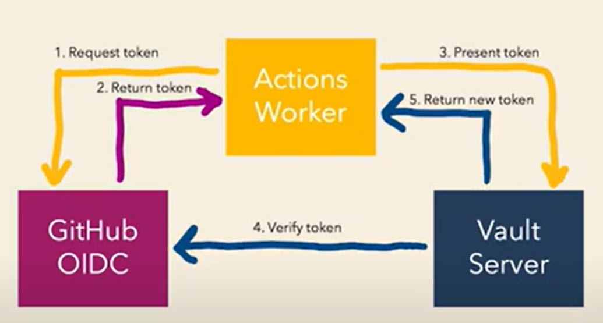

# GitHub Actions with Vault OIDC Demonstration

A demonstration of using GitHub OIDC to authenticate to HashiCorp Vault.

This repo accompanies a talk delivered at HashiConf Global at this link:  

Hashicorp: https://www.hashicorp.com/resources/using-oidc-with-hashicorp-vault-and-github-actions

Youtube: https://www.youtube.com/watch?v=lsWOx9bzAwY

## Summary

We are establishing a workflow where our GitHub Actions can securely access secrets stored in HashiCorp Vault using OpenID Connect (OIDC). The key steps involved in this process are:
 
1. **Configuration in GitHub**: We are setting up secrets in our GitHub repository that GitHub Actions will use to interact with the Vault server. These secrets include the Vault server address, namespace, the path where our secret is stored, the key of the secret, and the role for authentication.
 
2. **Vault ACL Policy**: We are creating an Access Control List (ACL) policy in Vault that specifies what the GitHub repository can do with the secrets. In our demo, the policy named after the GitHub repo has read and list permissions on the `sauce_recipe` path.
 
3. **JWT Authentication**: In Vault, we are enabling JWT (JSON Web Token) as an authentication method, which allows GitHub Actions to authenticate with Vault using a token issued by GitHub.
 
4. **JWT Role**: We are creating a role in Vault specifically tied to our GitHub repository that specifies the constraints for authentication, like the allowed audience (which is the URL of the GitHub repository) and the subject (the specific branch of the repository). This role enforces that only tokens with these claims are accepted, providing security by ensuring that only actions running from the specified GitHub repository and branch can access the secrets.
 
The high-level goal is to secure and streamline the process by which our GitHub Actions workflows access and use secrets from Vault during their execution. This setup ensures that the secrets are not hardcoded into the codebase or GitHub Actions configuration files, which would be a security risk. Instead, it dynamically fetches them from Vault, leveraging OIDC for secure, token-based authentication.


## How a GitHub Action Obtains Secrets



## Terraform and HCP Integration Guide

The reason HCP is being used in the terraform scripts is because the `terraform.tf` file specifies a cloud configuration block as follows:

```hcl
cloud {
    organization = "<organization_name>"
    workspaces {
        name = "<workspace_name>"
    }
}
```

## Create a Hashicorp Cloud Platform Account

You will need an account on the Hashicorp Cloud Platform (HCP) to use this guide.

## Create a Project

Once you have an HCP account, if a default project does not exist, create a new project within the HCP.

## Creating a Service Principal in HCP

Create a Service Principal at the Project level (to use with Terraform) following this guide: [Service Principal Creation Guide](https://registry.terraform.io/providers/hashicorp/hcp/latest/docs/guides/auth)

- **HCP Client ID:** `<hcp_client_id>`
- **HCP Client Secret:** `<hcp_client_secret>`

## Configuring Vault

Note that environment variables don't directly work through the command line for this setup. The `HCP_CLIENT_ID` and `HCP_CLIENT_SECRET` must be predefined within HCP settings. It's necessary to configure these environment variables within HCP to ensure functionality.

## Executing Terraform

Commands to be executed:

```bash
terraform plan
terraform apply
```

## Post-Terraform Application

After successfully applying the Terraform configuration, you should see the following output:

```plaintext
Apply complete! Resources: 3 added, 0 changed, 0 destroyed.

Outputs:
vault_admin_token = "<vault_admin_token>"
vault_public_endpoint_url = "<vault_public_endpoint_url>"
```

## Configuring the Demo

Set the `VAULT_TOKEN` (using the vault_admin_token) and `GITHUB_TOKEN` as environment variables within the HCP cloud workspace, then execute the Terraform plan and apply commands with the respective variables:

```bash
terraform plan -var="vault_server_url=<vault_public_endpoint_url>" -var="github_organization=<github_organization>" -var="github_repository=<github_repository>"
terraform apply -var="vault_server_url=<vault_public_endpoint_url>" -var="github_organization=<github_organization>" -var="github_repository=<github_repository>"
```
